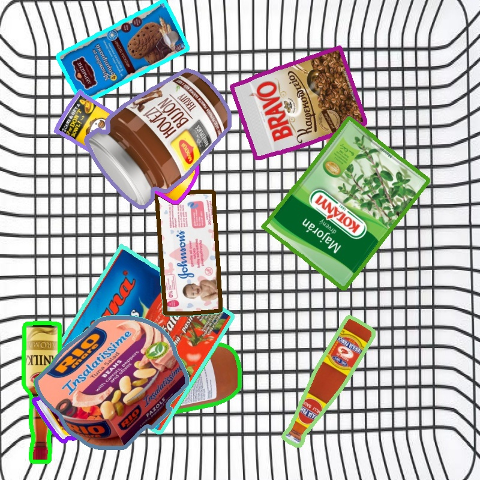

# Create datasets from PNG images
### This project is about create datasets from PNG images for instance segmentation. 

- #### Create static datasets for instance segmentation using 4-channel png images
- #### Result is background with randomly placed items and label with polygon coordinates  
- #### Labels are default yolo format
- #### Size of icons from which data will be made must be normalized.
- #### Using alpha channel as mask we can extract polygon as X, Y coordinates.
- #### Backgrounds and icons are in data folder
- #### After run code, results will be saved in data folder


### Venv:
```
python -m venv .venv
.venv\Scripts\activate
pip install -r requirements.txt
```
### Run:
```
python main.py --number 10
```
**NOTE:** See arg parser for another options
### Venv export:
```
pip freeze > requirements.txt
```